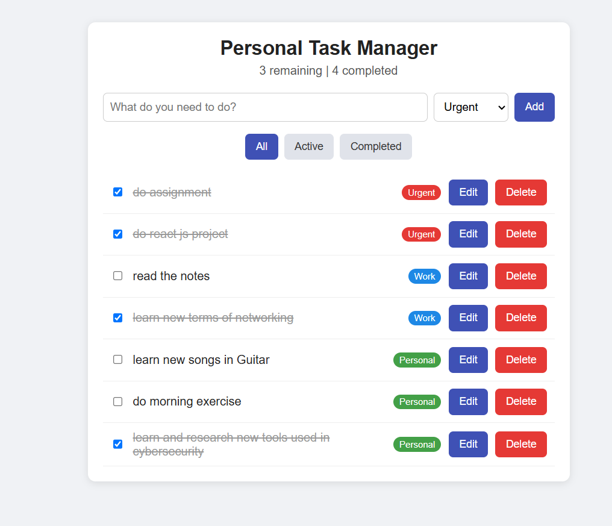
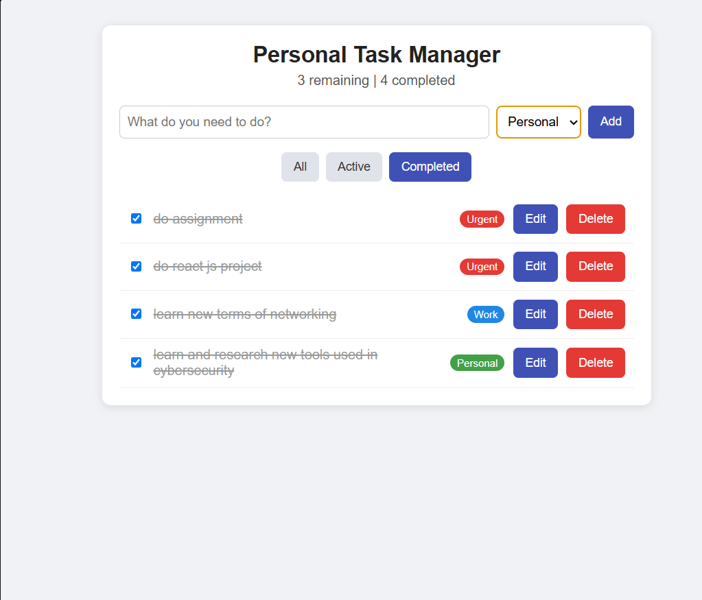
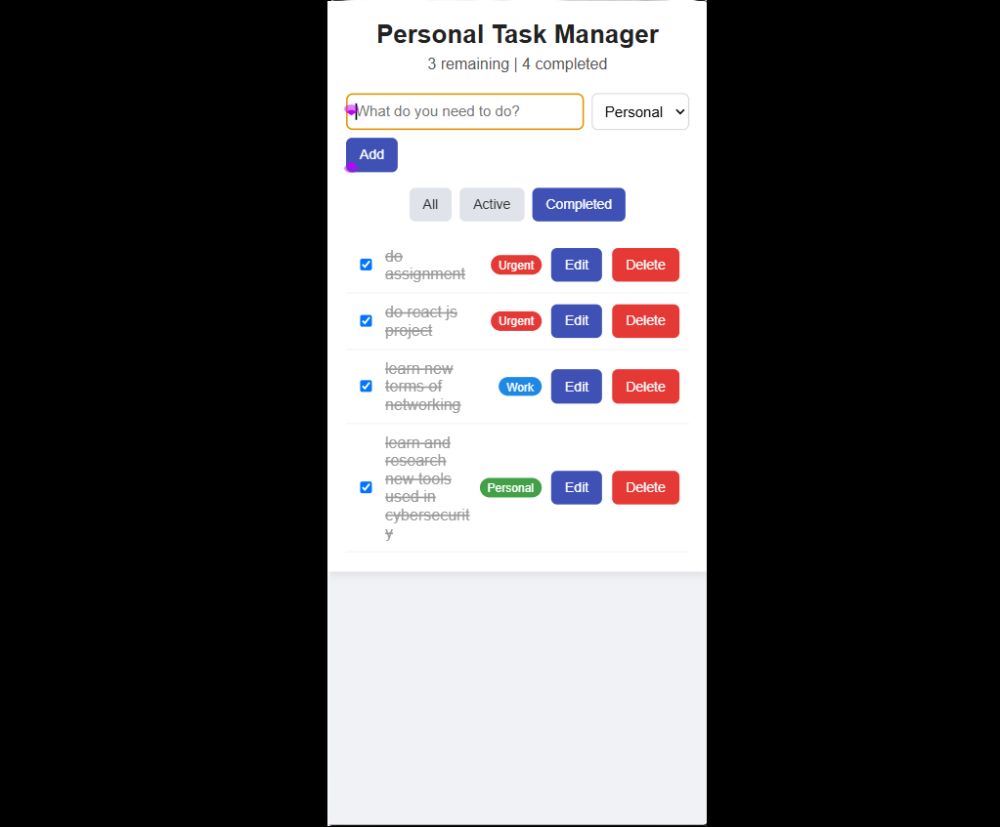

# Personal Task Manager

A single-page React application for adding, organising and tracking daily to-dos. Tasks can be edited, categorised, filtered by status, and are saved in the browser so they survive a page refresh.

**Live link:**[task-manager-three-taupe-75.vercel.app]

## Features

- Add, edit, delete and mark tasks as complete
- Filter tasks: All / Active / Completed
- Categories: Work, Personal, Urgent (colour-coded tags)
- Persistence with localStorage
- Live count of remaining and completed tasks
- Empty-state message and responsive layout (desktop and mobile)

## Technologies

- React 18 (functional components, hooks)
- Vite (build tool)
- Plain CSS

## Project Structure

```
src/
  main.jsx
  App.jsx            (state + logic)
  App.css
  components/
    Header.jsx
    TaskForm.jsx
    FilterBar.jsx
    TaskList.jsx
    TaskItem.jsx
```

## Setup Instructions

1. Install Node.js (v18 or later)
2. `npm install`
3. `npm run dev` (open the local URL shown in the terminal)

## Screenshots





## Known Limitations

- Tasks are stored only in the current browser (no login or cloud sync)
- No drag-and-drop, due dates or dark mode (optional stretch goals)
